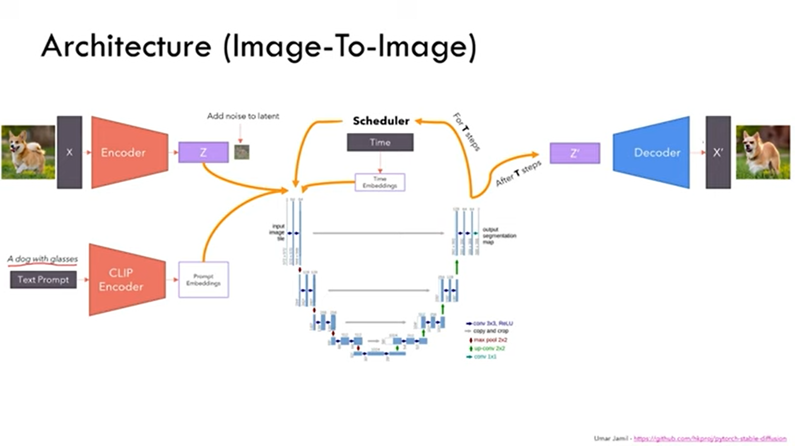
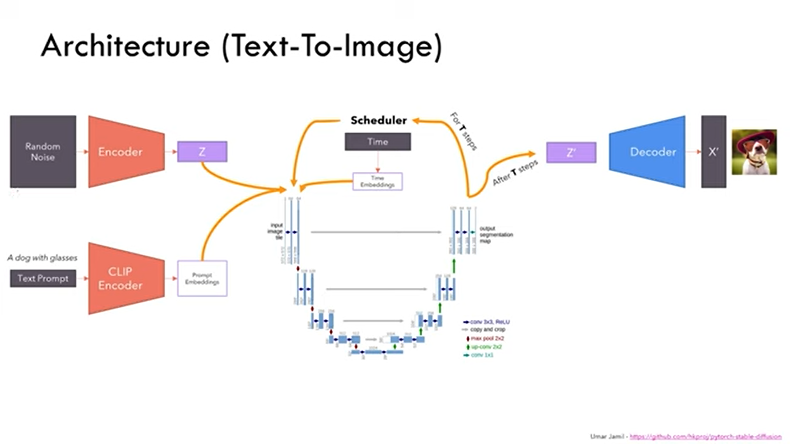

# Stable_Diffusion_from_scratch
implementation of Stable Diffusion Architecture from scratch

  
  

#### Implementation of [AutoEncoder](https://github.com/01PrathamS/Stable_Diffusion_from_scratch/blob/main/notebooks/AutoEncoder_implementation.ipynb)
#### Implementation of [Variational AutoEncoder](https://github.com/01PrathamS/Stable_Diffusion_from_scratch/blob/main/notebooks/VAE_implementation.ipynb)
#### Implementaiton of [U-NET](https://github.com/01PrathamS/Stable_Diffusion_from_scratch/blob/main/notebooks/UNET_implementation.ipynb)
#### Latent Space Comparison [AutoEncoder vs Variational AutoEncoder](https://github.com/01PrathamS/Stable_Diffusion_from_scratch/blob/main/AE_vs_VAE_latent_space.ipynb)

## Reference 
[Stable Diffusion Implementation](https://www.youtube.com/watch?v=ZBKpAp_6TGI)
